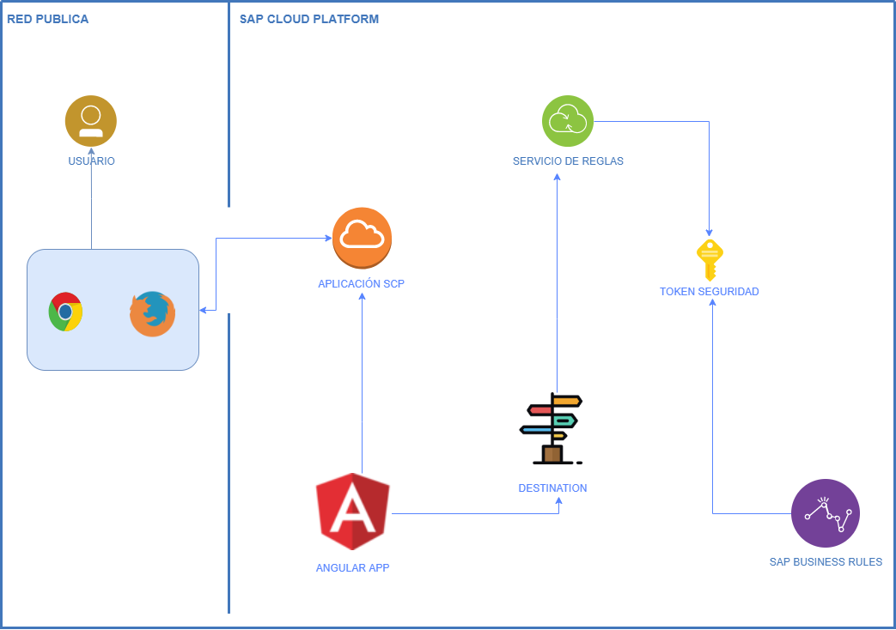

# SBR AngularJS 

___

## Consulta crédito

Aplicación construida con **AngularJS** para consumir los servicios expuestos a través de **SAP Business Rules.** En este ejemplo se consulta el limite de crédito de un cliente.

## Arquitectura 🧱



### Ejecución ⚙️

Abrir ***webapp/index.html*** en cualquier servidor web.

### Consideraciones ❗

Lista de consideraciones para ejecutar el proyecto.

- En el archivo ***webapp/services/master.js*** cambiar el valor de la variable **authorization** con el usuario y contraseña de SCP en base64:

```javascript
const authorization = "Basic <base64 user:pass>";
```

- Al tratar de consumir los servicios puede tener problemas de CORS. Esto se soluciona si abre un navegador con la seguridad deshabilitada; ejemplo en Google Chrome:

```sh
chrome.exe --args --disable-web-security --user-data-dir="C:\chrome_temp"
```

## Autor 👨‍💻

**Sebastian Cardona**
    [Linkedin](https://www.linkedin.com/in/sebastiancardonaloaiza/)
